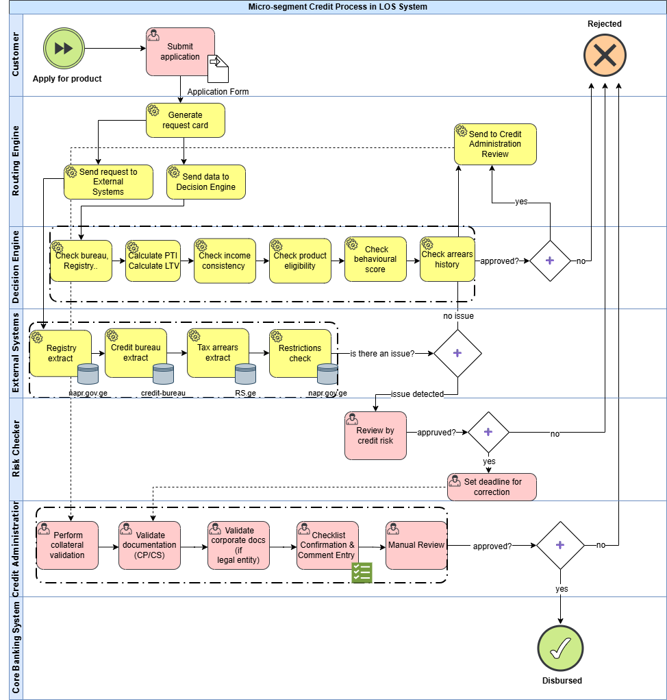
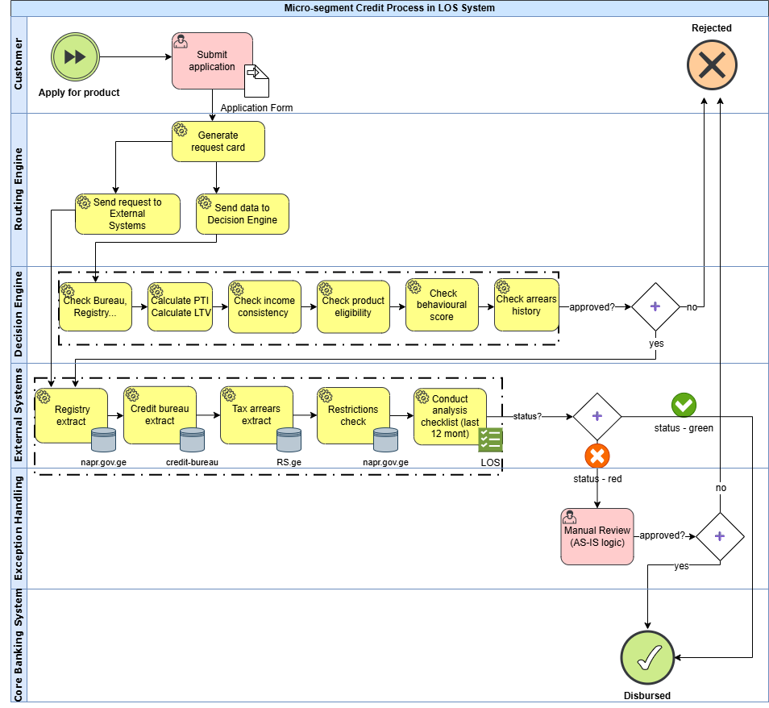

# Loan Issuance Automation in LOS System
**Business Analysis | Process Optimization | BPMN**

---

## Goal
To optimize the loan issuance process by enabling automatic disbursement of second and subsequent loans, provided that:
- the first loan’s issuance date is **within the last 12 months**, and  
- The first loan must not have a **RED checklist status**, and no registry changes must occur - any change (e.g. ownership, legal holds, or other critical fields) automatically sets the checklist to RED.

---

##  Problem (Before Automation)
In the AS-IS process:
- **100% of repeat loans** were routed to **manual review** by Credit Risk and Credit Administration.
- Operators manually checked: documents, collateral, tax arrears, scoring, credit bureau, restrictions.
- SLA violations and bottlenecks were frequent.
- The process was slow, error-prone, and not scalable.

---

## Result (After Automation)
- Manual review for repeat loans dropped from **100% → 20-30%**  
- Processing time: **30–60 minutes → under 1 minute**  
- Manual load on Credit Administration decreased dramatically  
- Customer experience improved (near-instant disbursement)  
- LOS system now routes cases automatically using checklist evaluation logic.  

---

##  AS-IS Process (Before)

---

##  TO-BE Process (After Automation)
Automation introduced:
- Checklist auto-reading
- Decision Engine routing (auto vs manual)
- Exception handling only for RED status or >12 months

---

